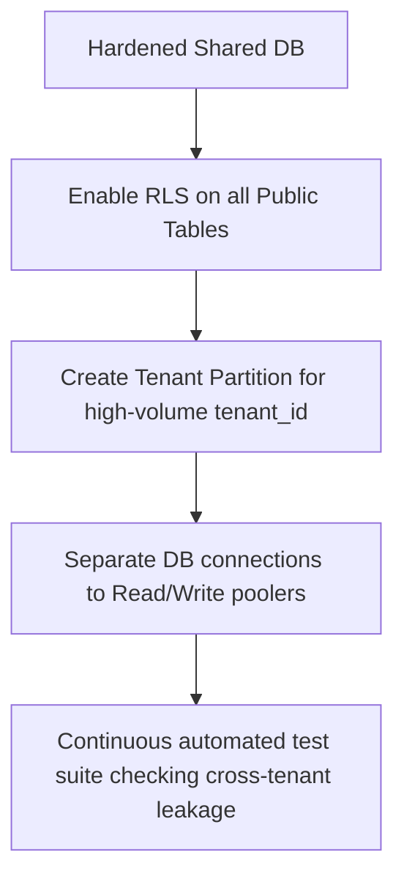

# Tenant Isolation Architecture Plan

This document analyzes and compares database architecture models to achieve stronger tenant isolation for the mobile ERP/Inventory Control application.

---

## 1. Architectural Options Comparison

| Dimension | Option A: Shared DB (RLS + Partitioning) | Option B: Schema-per-Tenant | Option C: Database-per-Tenant |
| :--- | :--- | :--- | :--- |
| **Isolation Strength** | Logical only (via Postgres RLS policies) | Logical isolation (separate PG schemas) | Physical isolation (separate DB instances / containers) |
| **Cross-Tenant Leakage Risk** | Medium-Low (relies on policy correctness) | Very Low (schema qualifier prevents cross-talk) | Zero (completely separate network / storage boundaries) |
| **Implementation Complexity** | Low (already partially implemented) | Medium (dynamic schema routing + schema migrations) | High (requires dynamic connection pooler + infrastructure provisioning) |
| **Migration Risk** | Very Low (no DDL mutations required) | Medium (need to split table data into schemas) | High (data dump, transport, and validation per tenant) |
| **Operational & Maintenance Cost** | Low (single DB instance to scale, back up, and monitor) | Medium (many tables to migrate, single database instance) | High (multiplying Postgres instances increases base RAM/CPU costs) |
| **Performance Scaling** | Good (with index/partitioning) | Medium-Poor (Postgres catalog bloat with >500 schemas) | Excellent (distributes load across CPU/memory boundaries) |

---

## 2. Deep Dive & Trade-offs

### Option A: Shared Database with Strict Row-Level Security (RLS)
* **Description**: All tenants share a single `public` schema. Separation is enforced logical-level by Postgres RLS (`CREATE POLICY ... USING (tenant_id = ...)`) and indexes.
* **Pros**: 
  - Lowest cost; minimal memory and storage overhead.
  - Simplest schema updates (run a single migration script).
  - Global aggregations/reporting are trivial.
* **Cons**:
  - A bug in RLS definition or forgetting `ENABLE ROW LEVEL SECURITY` on a new table can cause catastrophic data leaks.
  - Shared resource contention (noisy neighbor problem).

### Option B: Schema-per-Tenant
* **Description**: A single Postgres database instance where each tenant gets a dedicated schema (e.g., `tenant_hai_internal`, `tenant_reviewer_demo`). Global tables remain in `public` or a shared schema.
* **Pros**:
  - Stronger SQL-level containment (no shared table scans).
  - Simple client routing (set search path: `SET search_path TO tenant_x, public`).
* **Cons**:
  - Schema migrations must be run sequentially across all schemas, causing upgrade complexity.
  - Postgres `pg_catalog` bloat. Having hundreds of schemas with 100+ tables each degrades query planner speed.

### Option C: Database-per-Tenant
* **Description**: Every tenant runs on a dedicated database server or a completely isolated container/logical DB with distinct connection strings.
* **Pros**:
  - Perfect isolation. Complete safety against data leakage.
  - Custom backup/restore schedules per tenant.
* **Cons**:
  - Extreme operational costs. Minimum overhead per Postgres instance is high.
  - Routing connection pools dynamically (e.g., Supavisor/PgBouncer) adds architectural complexity.

---

## 3. Firm Recommendation

### Recommended Path: Option A (Shared DB + Strict RLS + Partitioning)
For this application, **Option A** remains the best balance between performance, simplicity, and cost efficiency, for the following reasons:
1. **Data Concentration**: 99.9%+ of all production rows belong to a single tenant (`hai_internal`). Creating schema-per-tenant or database-per-tenant infrastructure for demo or tiny secondary accounts represents significant over-engineering with zero immediate ROI.
2. **Postgres RLS Hardening**: Hardened RLS policies (which already exist in migrations) combined with strict automated tests offer near-zero leakage risk without changing connection management.
3. **Partitioning Strategy**: As table size grows (e.g., `marketplace_order_items` and `marketplace_finance_reports`), we should implement **Postgres Declarative Partitioning** by `LIST (tenant_id)` or `HASH (tenant_id)`. This physically separates data files on disk for high-volume tenants (like `hai_internal`) while preserving a single database connection.

---

## 4. Migration Blueprint (Transition to Option A Hardened)

### Steps:
1. **RLS Hardening**: Enforce `ALTER TABLE ... ENABLE ROW LEVEL SECURITY` and `ALTER TABLE ... FORCE ROW LEVEL SECURITY` on all scoped tables.
2. **Audit Automation**: Run `supabase/sql/dry_run_tenant_split_validation.sql` as a daily cron job to immediately catch any mismatched tenant IDs or foreign key violations.
3. **Scale Strategy**: Implement partition-by-tenant once any table surpasses 10 million rows.
