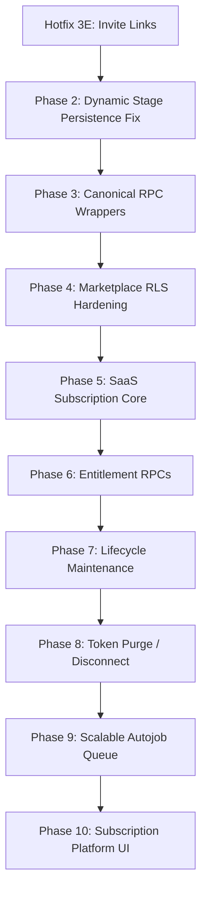

# Mobile ERP Phase Patch Roadmap

This document outlines the roadmap for future development phases (Phases 3 to 10), detailing how subsequent work can be executed incrementally and safely with minimal AI tokens and zero risk to stable systems.

---

## Roadmap Overview

---

## Safe Execution Strategy

To ensure zero regressions and minimize token cost during execution:
1. **Incremental Rerouting**:
   - Reroute Flutter RPC calls module by module instead of all at once.
   - Verify every UI screen after changing its backend hooks.
2. **Analysis-First Approach**:
   - Keep future phase schemas and scripts documented as drafts under `supabase/migrations_draft/`.
   - Apply them only when that specific phase is approved and active.
3. **Canonical RPC Convention**:
   - Never create duplicate numbered or versioned functions (e.g. `*_v2`, `*_v24_6_82e`).
   - Overwrite stable canonical functions or use clean unversioned names.
4. **No Destructive Operations**:
   - Do not drop old versioned functions or tables until all modules are rerouted and thoroughly verified on physical devices.
5. **No Cron/Worker Activation**:
   - Keep lifecycle maintenance scripts, sync crons, and queues manual or dry-run only until explicitly approved.
